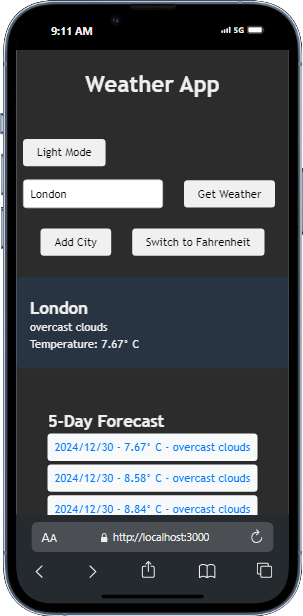

# Weather App

A simple weather app built with React that allows users to check the current weather and a 5-day forecast for any city. The app uses the OpenWeatherMap API to fetch weather data and offers features like dark mode, unit conversion (Celsius/Fahrenheit), and saving cities for later access.

## Features

- **Current Weather**: Displays the current weather for any city.
- **5-Day Forecast**: Shows a 5-day forecast with temperatures and weather descriptions.
- **Dark Mode**: Toggle between light and dark themes.
- **Unit Conversion**: Switch between Celsius and Fahrenheit.
- **Save Cities**: Add and view previously searched cities.

## Demo

You can view the live demo of the app [here](https://weather-app-74wr.vercel.app/).



## Technologies Used

- React
- OpenWeatherMap API (for weather data)
- Axios (for API requests)
- CSS (for styling)

## Prerequisites

- Node.js (v14 or later)
- npm (v6 or later) or yarn

## Setup Instructions

### 1. Clone the Repository

```bash
git clone https://github.com/yourusername/weather-app.git
cd weather-app
